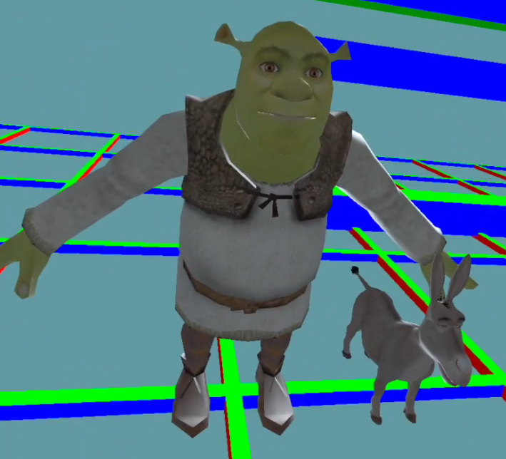

# *RevolVR Sample Project*

## Table of Contents
* [Overview](#overview)
* [Getting started](#getting-started)
* [Scene description files (.rvr)](#scene-description-files-overview)
* [Creating your own scenes and Rituals](#custom-rituals--scenes)
* [Loading gltf files](#loading-gltf-files)

## Overview
This project contains examples to get RevolVR running for Quest 1, 2 & maybe others. For more information regarding the aims, features, and future work of RevolVR please defer to [this repo](https://github.com/satchelfrost/revolvr.git).

## Getting started
To run the examples in general we need to do the following:

* Install Android Studio (Properly)
* Ensure the SDK tools, CMake version, and all dependencies are installed
* Open the project in Android Studio
* Choose the example scene of interest
* Build & deploy to the headset

To install android studio properly please refer to Meta's documentation [Android Development Setup](https://developer.oculus.com/documentation/native/android/mobile-studio-setup-android/). You will also need to ensure your headset is in developer mode. All of this can be found on Meta's developer documentation.
>**_IMPORTANT:_** If you are using Windows don't skip the environment variable setup (Linux you should be okay, & Mac??)

Ensure that the CMake bundled with android is the correct one. You can do this by going to the SDK manager in android studio, going to SDK tools and checking CMake (3.22.1).

Be sure to clone this repo recursively, since it contains nested submodules:
```bash
git clone --recurse-submodules https://github.com/satchelfrost/revolvr-sample-project.git
```

or, if you've already cloned without doing that, you can run:

```bash
git submodule update --init --recursive
```

Open the sample project in Android Studio and let the gradle settings sync. You will probably encounter some issues here, so just be patient, read the error messages, and google. Android studio can be a little finicky sometimes.

In order to choose an example scene to load, it's currently a bit hacky. You must first navigate to [revolvr/src/app.cpp](revolvr/src/app.cpp) where the scenes are being loaded, and comment/uncomment the scene you want to load. This will most definitely be changed, but for now that's how it works. The example scene files themselves can be found in the [app/assets](app/assets/test_scenes/) folder. The corresponding source files (non-engine related) are in [app/src/main/cpp](app/src/main/cpp) & [app/include](app/include).

From there you should be able to deduce more about the relationship between the Rituals (C++ game logic) and scene description files (.rvr).

## Scene Description Files Overview
The .rvr files serve as the scene description file format. Lets look at an example [timer.rvr](app/assets/test_scenes/timer.rvr). For a complete look at the syntax you can look at the [grammar](revolvr/include/scene/rvr_grammar.txt), but if you just want the high-level, then follow along.

The first header section is an entity with entity id 0 named Origin. The root node must contain a Spatial. 

```
[entity id=0 name=Origin]
Spatial.position {0, 0, 0}
```

You can get away with the simpler syntax "Spatial {}", or be specific about the fields e.g. scale, position, & euler. In general specifying a component with empty curly braces means the defaults will be applied (except in cases where defaults are not allowed, a runtime error message will occur).

The entity id (in this case 0) will hold true at runtime, so if you want that id, we can later grab it in C++ with

```cpp
rvr::Entity* root = GetEntity(0);
```

or if you want a particular component then,

```cpp
rvr::Spatial* rootSpatial = GetComponent<Spatial>(0);
```


Next we have the player. Most of the time the "name" portion of the header doesn't matter, with the exception of player. To tell the engine that this entity is the player we set name equal to 'Player' or 'player'. This is required.

```
[entity id=1 name=Player]
Spatial.position {3, 0, 0}
```

In this example the player will now spawn 3 meters to the right of the origin.

> **_NOTE:_** +x, +y, & +z are right, up, and backward respectively. -x, -y, & -z are left, down, and forward respectively.

> **_NOTE:_** The player can be the origin, but it is not recommended.

Moving on we see:

```
[entity id=2 name=Left_Controller parent=1]
TrackedSpace.type {LeftController}
Spatial.scale {0.1, 0.1, 0.1}
Mesh {}
```

Note that parent=1, meaning we are explicitly parenting the left controller to the player. If you do not specify a parent in the header like this, then that entity will be parented to the root (i.e. entity with id==0). We can also see the TrackedSpace type LeftController. There are a few tracked space types (LeftController, RightController, Head, and the several hand joints). This tells the engine that this entity should set the corresponding spatial with the tracked space from OpenXR.

> **_NOTE_:** This also means to have a TrackedSpace you must also have a corresponding Spatial.

For more complex entity behavior we can add a Ritual component, if we look at the timer_box_maker we add a Ritual TimerBoxMaker (the exact name of the corresponding C++ class).

```
[entity id=4 name=timer_box_maker]
Ritual.type {TimerBoxMaker}
Ritual.can_update {false}
Timer.wait_time_milliseconds {250}
Timer.one_shot {false}
Timer.auto_start {true}
```

Rituals can have multiple callbacks, but the main ones are Begin() & Update(). Begin() is called once, and Update() is called every frame. Rituals also have a constructor, which is called once on object construction, the detailed differences between Begin() and the constructor, are not important here. We can see that Rituals can choose not to update with Ritual.can_update {false}. Other callbacks like OnTimeout() and OnTriggered() are contingent upon the addition of Timer components and Collider components respectively. In other words, not having those components on the same entity, means they will never get called.

One thing that is very important is that in this section we appear to be writing keywords multiple times, for example we have 'Ritual' written twice, does that mean this entity has two Rituals?

> **_IMPORTANT_:** Entities cannot have more than one type of component. In other words, an entity could have a Mesh, Timer, Audio, Spatial etc., but it cannot have two spatials. Therefore, writing the component on multiple lines (as is the case with Timer) is referring to that one component (In this case Timer's wait_time, auto_start, and one_shot fields).

But what if I want an entity to have more than one type of component e.g. two spatials? In that case you need to make a separate entity and create a separate component. If you still want the two to be intimately related then make one entity the parent/child of the other.

See the [timer_box_maker.cpp](app/src/main/cpp/timer_box_maker.cpp) for further details of this scenario. If running the scenario, be sure that the timer.rvr scene is being loaded as described in [Getting Started](#getting-started).

## Custom Rituals & Scenes
If you've made it this far then you're ready to create your own scenes/levels. To start, you can copy one of the existing .rvr files and adjust it to your needs. In order to create a custom Ritual you will need to do the following:

* Create the Ritual with `create_ritual.py`
* Add the Ritual to the proper header files
* Add your Ritual logic / scene description file specifics

Open a command line and cd into the [ritual maker tool directory](revolvr/tools/ritual_maker). The simplest example creates a named Ritual called MyRitual,

```bash
python3 create_ritual.py MyRitual
```

which will create two files `my_ritual.cpp` and `my_ritual.h` in the [app/src/main/cpp](app/src/main/cpp) and [app/include](app/include) folders respectively.

> **_NOTE_:** For more command line options use `python3 create_ritual.py -h`

Next we need to make the engine aware of these. Navigate to [app/include/ritual_list.h](app/include/ritual_list.h) and [app/include/ritual_hdrs.h](app/include/ritual_hdrs.h). In the first, append your class name to the RITUAL_LIST macro:

```cpp
X(MyRitual) \
```

This lets the engine know about the class, and consequently enables you to specify the ritual in the scene description file e.g.

```
[entity id=blah]
Ritual.type {MyRitual}
```

Next update the ritual_hdrs.h with the name of the ritual `.h` file. In this case:

```cpp
#include "my_ritual.h"
```

This of course let's C++ know where to find the class so it can compile and link.

If all builds then you are all set!

> **_NOTE_:** Sometimes the auto-complete / syntax highlighting can get a little weird when you add new classes. To fix this in Android Studio you should be able to delete the `.cxx` folder inside the app, and then hit the gradle sync.

## Loading gltf files
In order to load a gltf file simply specify the path starting from the assets folder as follows:

```
[entity id=15]
Mesh.gltf {gltf/shrek/scene}
Spatial.position {0, 0, -2}
Spatial.scale {2, 2, 2}
Spatial.euler {-90, 0, 0}
```

Here we can see that in the assets folder we have subfolders `gltf/shrek/scene`. Note that scene is actually `scene.gltf`. However we don't need to specify the extension.



For now each model is only loaded in memory, and every successful load using Mesh.gltf will actually just point to the same memory. The position, scale, euler, etc. can all be adjusted just like the previous examples.